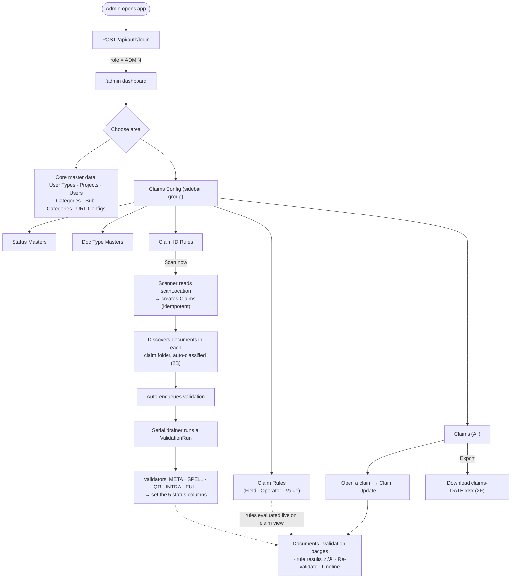
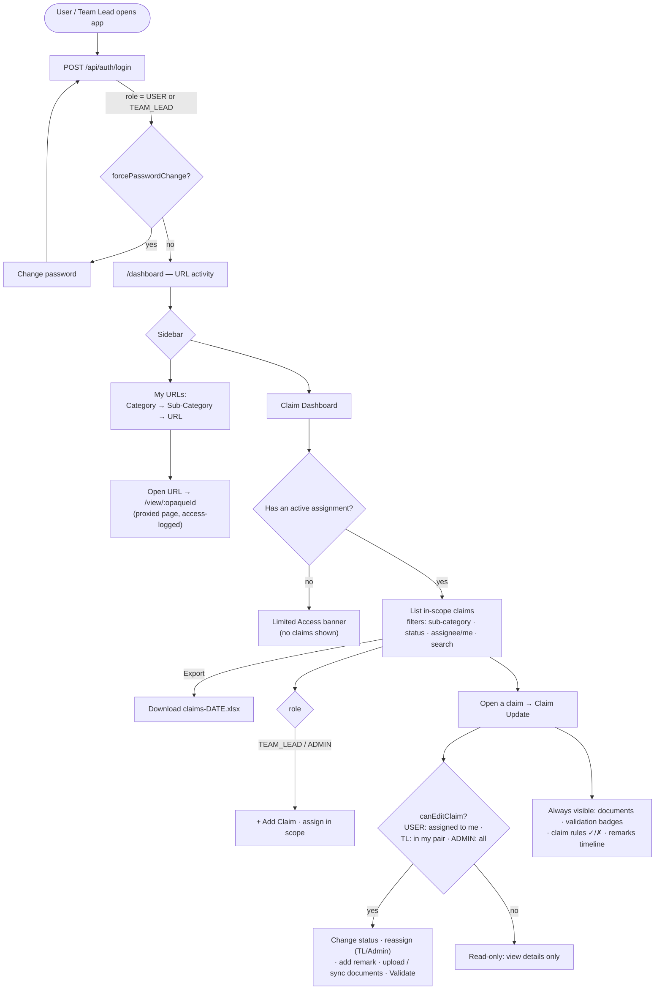

# ProxyURLApp — Admin & User Flows

Flowcharts of the two main journeys through the app, including the Claims module (Phases 1 + 2A–2F).
Diagrams use [Mermaid](https://mermaid.js.org/) — they render on GitHub and in VS Code's Markdown preview (with the Mermaid extension).

**Roles:** `USER` < `TEAM_LEAD` < `ADMIN`. Auth is a server-side session (httpOnly cookie); `ProtectedRoute` gates the client; `adminMiddleware` / `scopedMiddleware` gate the server.

---

## Admin flow

---

## User / Team Lead flow

---

## Legend / notes

- **Solid arrows** = navigation or a triggered action. **Dotted arrows** = data feeding a view (e.g., validation results and live-evaluated rules show on the Claim Update page).
- **Scope:** a `USER` sees all claims in their `(UserType, Project)` pair but can only edit ones assigned to them; a `TEAM_LEAD` can edit any claim in their pair; an `ADMIN` sees/edits everything. The same scope governs the export.
- **Validation lifecycle:** each of the 5 columns goes `PENDING → IN_PROGRESS → PASSED/FAILED` during a `ValidationRun`. Runs are auto-enqueued after ingestion/upload and can be triggered manually ("Validate").
- **Claim Rules (2E)** are admin-defined and evaluated **live** when a claim is viewed (not stored).
