# Document Verification Update

Date: 26 Sep 2026  
Environment: Production, http://122.180.247.166:3001 (deployed 24 Sep 2026)  
Scope: points from the 22 Sep review and Phase 1 rows of the Doc Verification sheet

## How the proofs were made

Rules only show on a claim that breaks them, so test claims were created on production in sub-category ISL - DVS - Test V1. Each has one small PDF made to trigger one rule, marked TEST DOCUMENT on every page. The customer names were loaded through the normal observation sheet import.

| Claim ID | Proves |
|---|---|
| TEST-DMS-01 | DMS name vs Invoice |
| TEST-RC-01 | Invoice vs RC: Diff Name |
| TEST-RC-02 | Invoice vs RC: Same Name |
| TEST-KYC-01 | KYC name mismatch is a red flag |
| TEST-NOM-01 | Nominee name missing |
| TEST-DUP-01, TEST-DUP-02 | Duplicate address, PRAN, ESI, Pension No |
| TEST-DL-01 | DL format, impossible date, red flag counts |

The test PDFs were generated by software, so they also get the red flag Document produced/edited by ReportLab. That is correct behaviour and can be ignored for these claims.

To check any point yourself: open Claim Dashboard, search the claim ID, open the claim. The card is on the claim page. Click the file name inside the card to open the document with the findings on the right. Click a finding to zoom to it.

## 1. Claim page

Claim ID: MZBB1811LSN014084 (real claim)

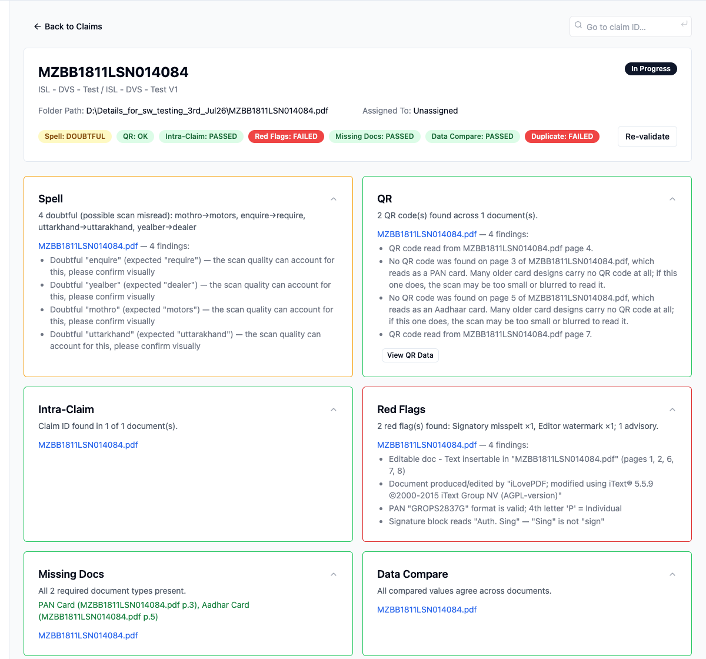

- All check cards are expanded by default. A card can still be collapsed from its header.
- New Data Compare check with its own card and status badge.
- Claim Rules panel removed from the claim page, as most of its rows repeated the check badges.

Why: in the 22 Sep review the cards had to be opened one by one, and the Data Compare results were inside Missing Docs where they were hard to find.

## 2. Findings panel: red flags first, value boxed

Claim ID: TEST-DUP-02

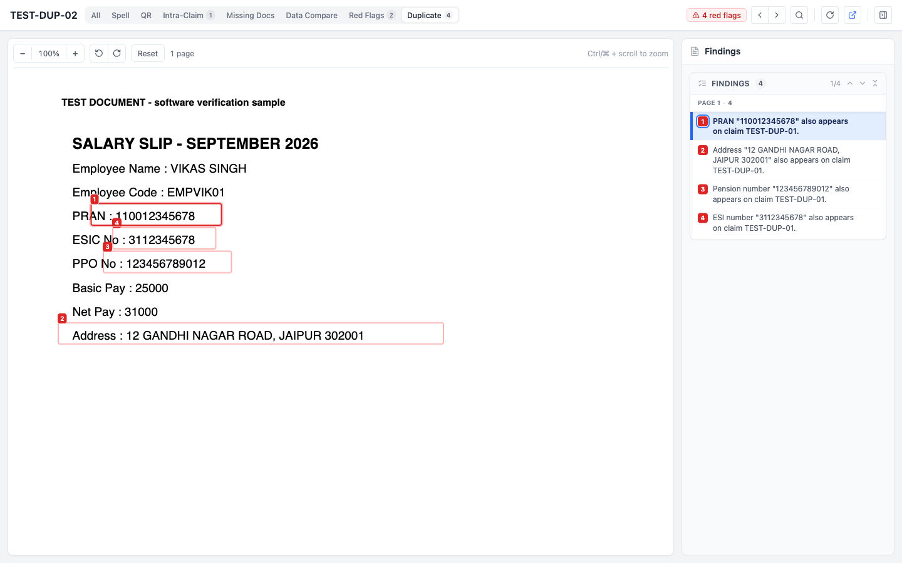

- Red flags are listed first, then advisories, grouped by page. The document opens on the first red flag.
- Each finding is numbered and the value is boxed on the document with the same number. Clicking a finding zooms to it.

Steps: open TEST-DUP-02, click TEST-DUP-02.pdf in the Duplicate card.

## 3. Claims list

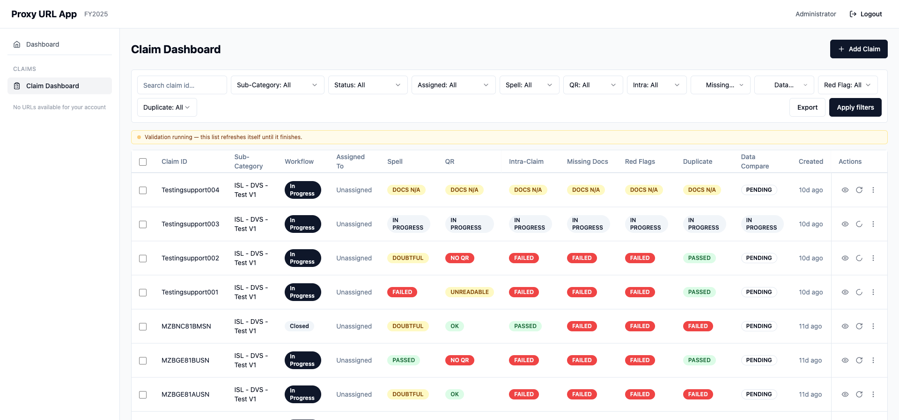

- New Data Compare column and filter. The column is also in the Excel export.
- Claims validated before 24 Sep show PENDING until they are re-validated (select claims, click Validate).

## 4. Data Compare: DMS Upload File vs Invoice

Sheet row: High, 1, DMS Upload File, Customer Name, Invoice, Customer name, If different with both documents - Red Flag, 1st Chk to apply.

Claim ID: TEST-DMS-01. DMS customer name SURESH KUMAR (from the imported sheet), invoice says RAHUL VERMA.

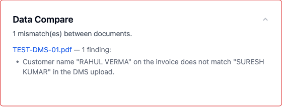

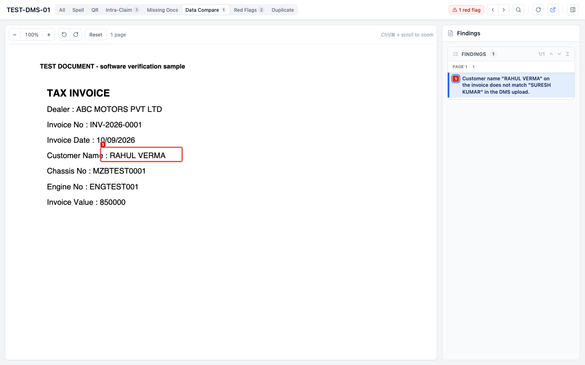

How it works: the Customer Name column of the observation sheet import is taken as the DMS value and compared with the customer name on the invoice (Customer Name or Bill To). Titles like Mr/Mrs and word order are ignored. A mismatch is a red flag and is listed first on the card.

Steps: open TEST-DMS-01, see the Data Compare card, click TEST-DMS-01.pdf to see the box on the invoice name.

## 5. Data Compare: Invoice vs Old car RC, Same Name / Diff Name

Sheet row: High, 1, Invoice, Customer name, Old car RC, Customer name, If details are different with both documents - Red Flag, Same Name / Diff Name.

Claim ID: TEST-RC-01 (invoice RAJESH KUMAR, RC owner MOHAN LAL)

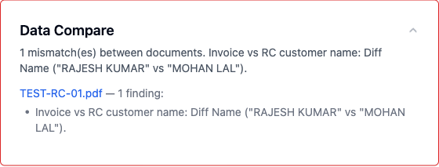

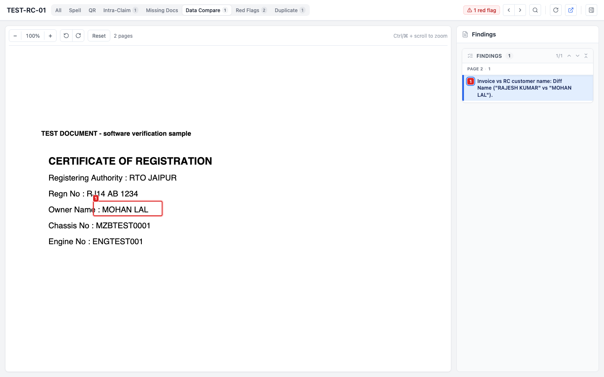

Claim ID: TEST-RC-02 (same name on both)

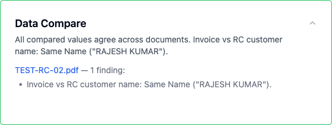

How it works: when a claim has both an invoice and an RC, the card states the result as Same Name or Diff Name. Diff Name is a red flag and is reported once. Same Name is shown as a note and the check passes.

## 6. Data Compare: KYC name mismatch is a red flag

Sheet row: High, 1, Invoice, Customer Name, Every Doc and KYC, Name, If different with both documents - Red Flag.

Claim ID: TEST-KYC-01 (invoice RAJESH KUMAR, KYC name SURESH SHARMA)

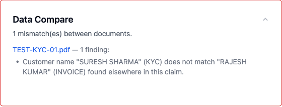

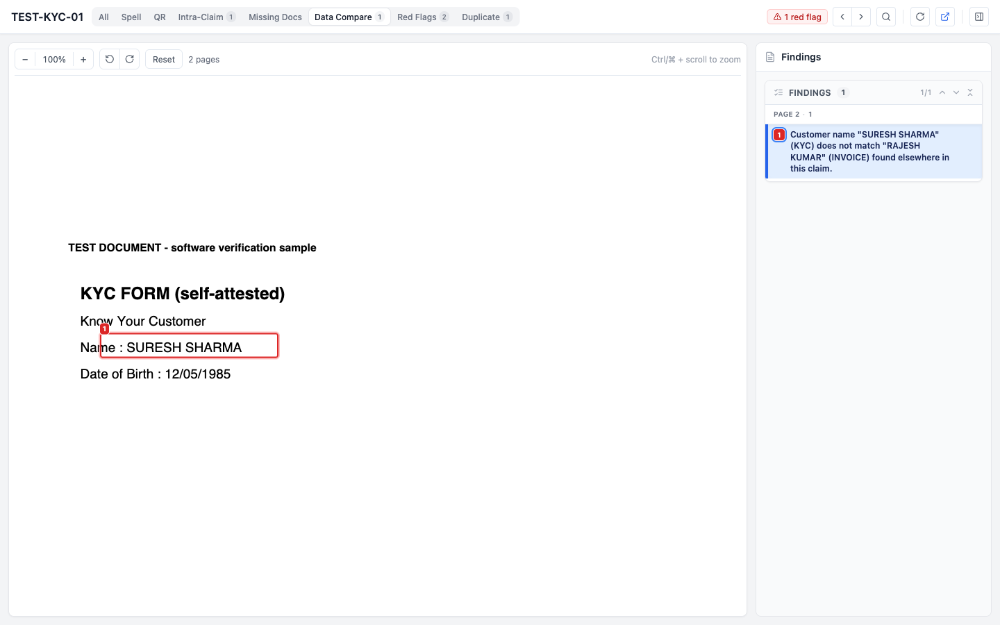

How it works: this was an advisory earlier, because a KYC document is sometimes of a family member. As per the sheet it is now a red flag. Father, mother and spouse names are compared separately and do not raise this.

## 7. Data Pattern: nominee name missing

Sheet row: Normal, 1, Insurance, Nominee name is missing but other nominee details are present (name prefix to be ignored), Show result - No name in Nominee but other details available.

Claim ID: TEST-NOM-01 (nominee row reads Mrs. 42 SPOUSE NA NA)

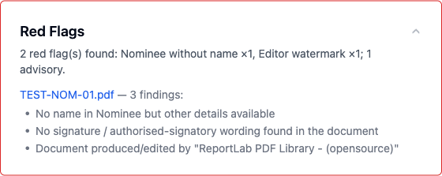

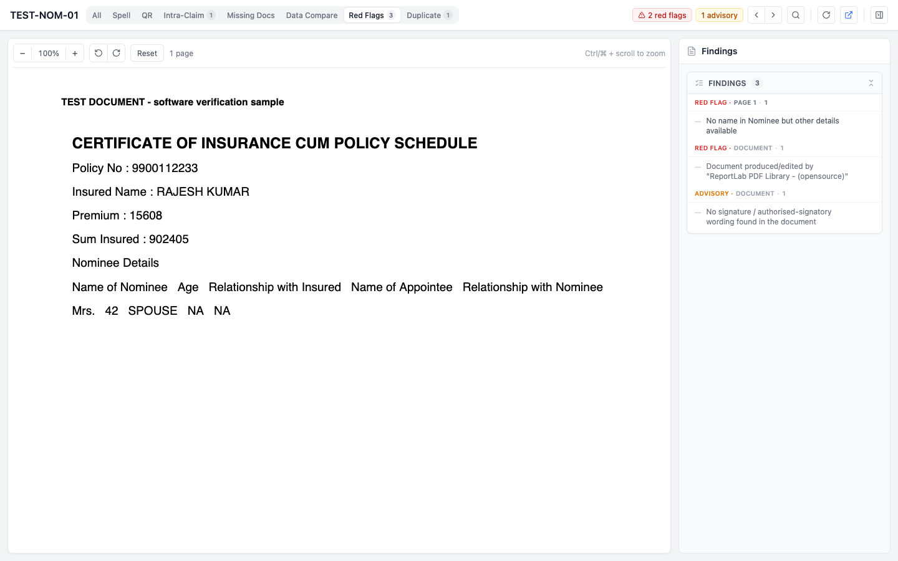

How it works: the row under the nominee header is read. If there is no name left after removing the prefix (Mr, Mrs, Ms, Smt, Shri) and NA, but age or relationship is filled, it is a red flag with the text from the sheet.

## 8. Data Pattern: DL number, impossible date, count per rule

Sheet rows: High, 1, DL, DL no. should be 16 digits, If not - Red Flag and its Count. High, 1, Every Doc, date, if any date is not as per calendar. Red Flag and its Count.

Claim ID: TEST-DL-01 (DL No MH142011006, Issue Date 31/04/2020)

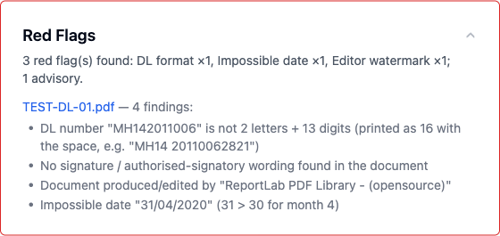

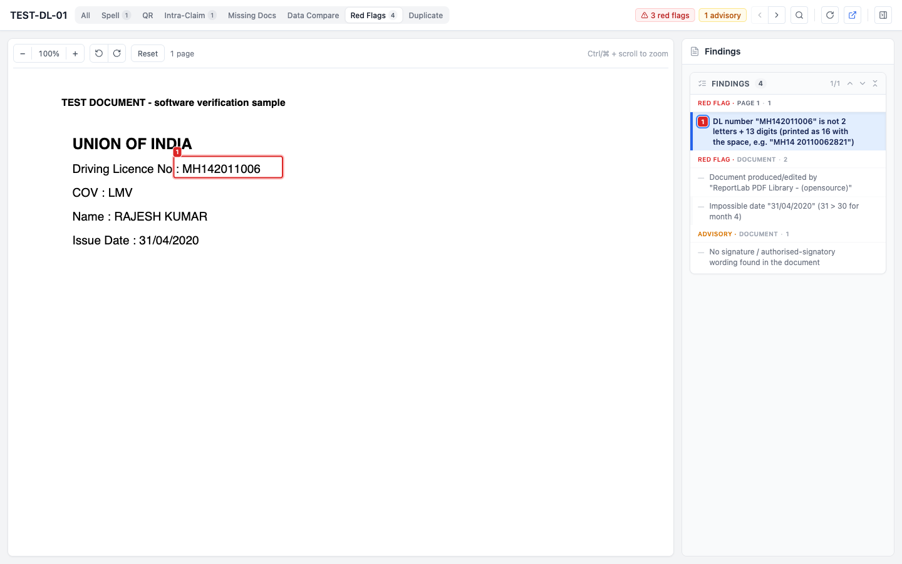

How it works: the DL number must be 2 letters and 13 digits, which is 16 characters when printed with the space (MH14 20110062821). 31 April is not a valid date. The card summary shows the count per rule: DL format x1, Impossible date x1.

## 9. Data Pattern: editable PDF

Sheet row: Normal, 1, All Pdf docs, If any text is editable in any pdf file, Editable doc - Text insertable in Doc Name.

Claim ID: MZBB1811LSN014084 (real claim), see screenshot in point 1, Red Flags card: Editable doc - Text insertable in MZBB1811LSN014084.pdf (pages 1, 2, 6, 7, 8).

How it works: in a PDF that is otherwise scanned, pages that carry real typed text (not scanned image) are listed. It is an advisory, because genuine digital insurance policies are often merged into the scan.

## 10. Duplicacy: address, PRAN, ESI, Pension No

Sheet rows: High, 1, Every Doc, Address, If Address is same in 2 different Case Ids - Red flag. High, 1, Salary Slip, Pran No, ESI No, Pension No.

Claim IDs: TEST-DUP-01 and TEST-DUP-02 (same address, PRAN, ESI and PPO number on both salary slips)

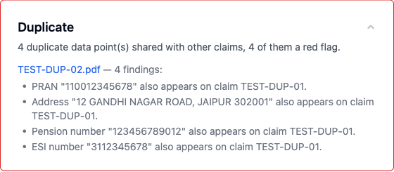

Document with all four values boxed: see point 2.

How it works: these values are stored for every validated claim and matched against other claims in the same sub-category. A shared address was an advisory earlier and is now a red flag as per the sheet. PRAN, ESI and Pension No are new.

## 11. Other fixes

- One page is counted as one document type. An invoice page with the text Bill To is no longer also counted as a Bill in Missing Docs.
- Designated Person Name (broker staff) on insurance policies is no longer read as the customer name.
- Customer name after Bill To on Kia invoices is now read, so the invoice is included in the name checks.
- Info notes (for example QR code read) are no longer listed as advisories.
